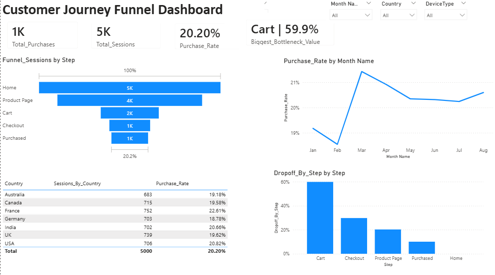
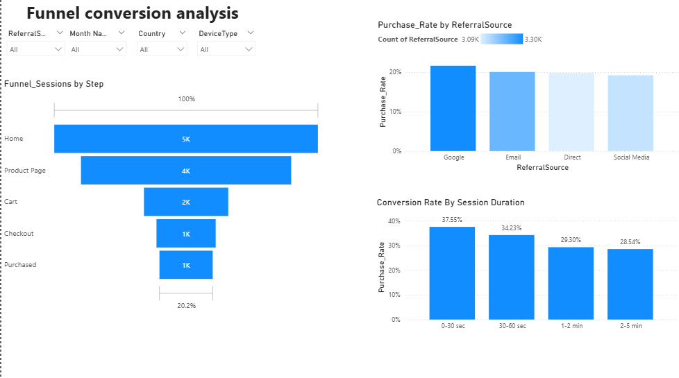
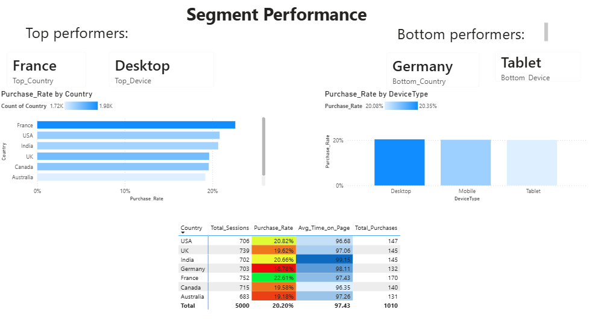
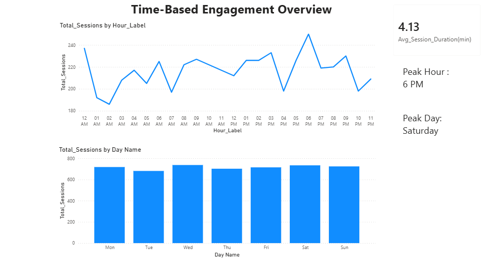
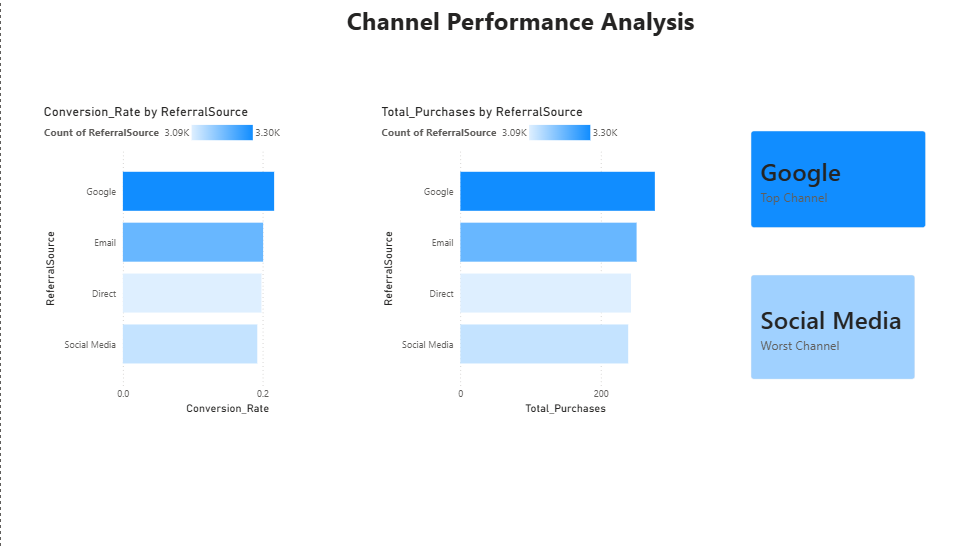
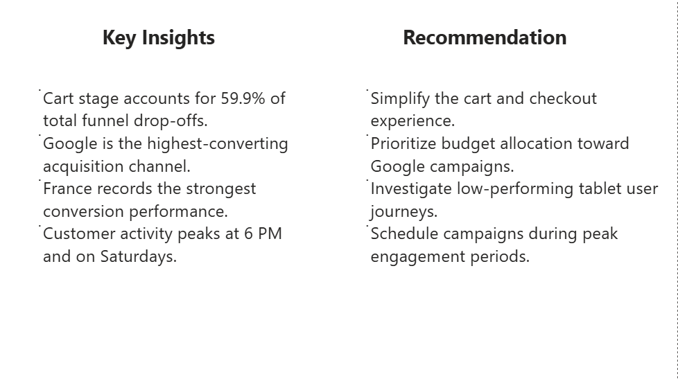
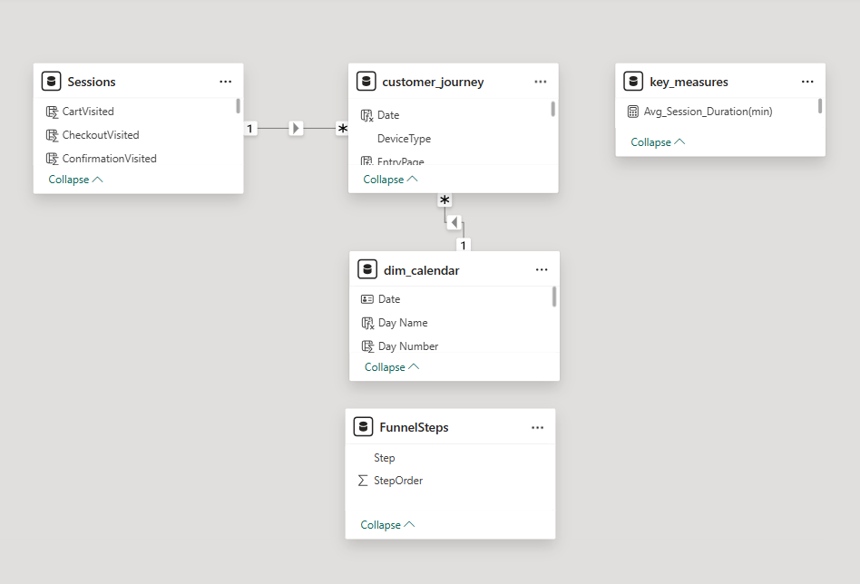

# Customer Journey Funnel Analysis Dashboard

## Project Overview

This project analyzes customer behavior throughout the online purchasing journey using Power BI. The objective is to identify conversion bottlenecks, evaluate marketing channel performance, compare customer segments, and uncover engagement patterns that influence purchasing decisions.

The dashboard provides actionable insights into how users move through the conversion funnel, where drop-offs occur, which acquisition channels perform best, and when customer engagement is highest.

---

## Business Objectives

- Analyze customer progression through the purchasing funnel.
- Identify the largest conversion bottlenecks.
- Measure purchase conversion rates.
- Evaluate acquisition channel effectiveness.
- Compare country and device performance.
- Discover customer engagement trends by day and hour.
- Generate business recommendations based on observed behavior.

---

## Dataset

The project started from a single raw dataset:

**customer_journey**

### Key Fields

- SessionID
- UserID
- Timestamp
- Country
- DeviceType
- ReferralSource
- PageType
- TimeOnPage
- ItemsInCart
- Purchased

---

## Data Cleaning & Preparation

Data preparation was performed using Power Query.

### Steps Completed

- Removed duplicate records.
- Validated data consistency.
- Standardized column data types.
- Prepared date and time fields for analysis.
- Cleaned and transformed session-level information.
- Optimized data structure for reporting and DAX calculations.

---

## Data Modeling

A star-schema style model was created to improve analytical performance.

### Fact Table

- customer_journey

### Supporting Tables

- Sessions
- dim_calendar
- FunnelSteps
- key_measures

### Sessions Table

Created to aggregate user behavior at the session level and track movement through key funnel stages:

- CartVisited
- CheckoutVisited
- ConfirmationVisited

### Calendar Dimension

Built to support time-based analysis.

Fields include:

- Date
- Month Name
- Month Number
- Day Name
- Day Number

### FunnelSteps Dimension

Created to maintain correct funnel ordering.

Funnel Stages:

1. Home
2. Product Page
3. Cart
4. Checkout
5. Purchased

---

## DAX Measures

A dedicated measures table was created containing key business metrics including:

- Total Sessions
- Total Purchases
- Purchase Rate
- Funnel Conversion Rate
- Drop-off Rate
- Average Session Duration
- Peak Engagement Metrics
- Top Performing Segments
- Bottom Performing Segments

---

## Dashboard Preview

### Page 1 – Funnel Overview

High-level view of customer conversions, funnel performance, monthly trends, and drop-off analysis.

---

### Page 2 – Funnel Deep Dive

Detailed analysis of conversion drivers across acquisition channels, devices, and session duration.

---

### Page 3 – Segment Performance

Comparison of country and device performance to identify top-performing and bottom-performing customer segments.

---

### Page 4 – Time-Based Engagement Overview

Analysis of customer activity by hour and day to identify peak engagement periods and behavioral patterns.

---

### Page 5 – Marketing Channel Analysis

Evaluation of marketing channels based on conversion rates and purchase performance to determine the most effective acquisition sources.

---

### Page 6 – Insights & Recommendations

Executive summary highlighting key findings and actionable business recommendations derived from customer journey analysis.

---

## Key Insights

- Cart stage represents the largest funnel bottleneck, accounting for approximately 60% of total customer drop-offs.
- Google is the highest-converting acquisition channel.
- France demonstrates the strongest purchase conversion performance.
- Customer activity peaks around 6 PM.
- Saturday shows the highest engagement levels.
- Longer session durations do not necessarily translate into higher conversion rates.

---

## Recommendations

- Simplify cart and checkout processes to reduce abandonment.
- Increase investment in high-performing Google acquisition campaigns.
- Investigate low-performing device experiences and user journeys.
- Schedule marketing campaigns during peak engagement periods.
- Replicate successful market strategies from high-performing regions.
- Continuously monitor funnel drop-offs and conversion metrics to improve customer experience.

---

## Technical Documentation

This project was not limited to dashboard development. Additional analytical and data preparation work included:

- Power Query data cleaning and transformation
- Removal of duplicate records
- Data validation and preparation
- Session-level behavioral modeling
- Calendar dimension creation
- FunnelSteps dimension creation
- Data model relationship design
- DAX measure development
- KPI calculations and business metrics

### Data Model

The project uses a structured data model consisting of a fact table and supporting dimension tables to improve analytical performance, enable scalable reporting, and support advanced business analysis.

---

## Tools & Technologies

- Power BI Desktop
- Power Query
- DAX
- Data Modeling
- Data Visualization
- Funnel Analysis
- KPI Development
- Customer Behavior Analytics
- Marketing Analytics
- Conditional Formatting

---

## Skills Demonstrated

- Data Cleaning
- Data Transformation
- Data Modeling
- DAX Development
- Business Intelligence
- KPI Design
- Funnel Analysis
- Customer Behavior Analysis
- Marketing Analytics
- Dashboard Design
- Business Recommendations
- Data Storytelling

---

## 

Bioengineering Graduate | Data Analytics Enthusiast | Power BI Developer
